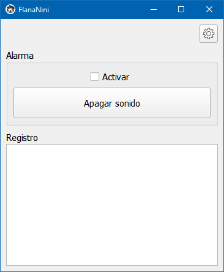
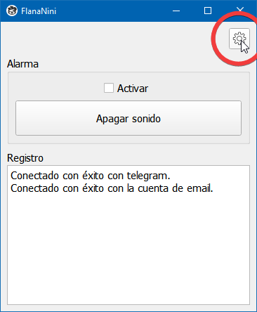
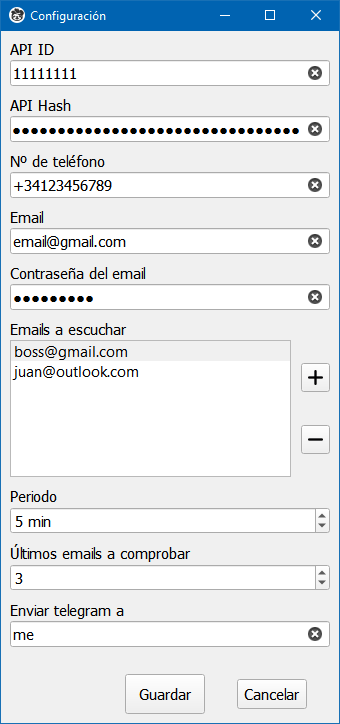
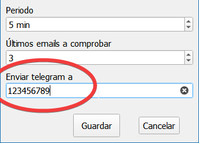
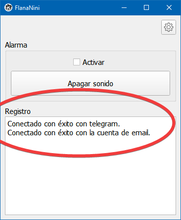

# FlanaNini
A cross-platform GUI application that alerts you when an email arrives and sends it via telegram to whoever you want.

## Built with
1. [Python](https://www.python.org/) - Programming Language.
2. [PySide2](https://pypi.org/project/PySide2/) - The official Python module from the Qt for Python project, which provides access to the complete Qt 5.12+ framework.
3. [Telethon](https://github.com/LonamiWebs/Telethon) - Asyncio Python 3 MTProto library to interact with Telegram's API as a user or through a bot account.

## Installation
1. Install Python.
2. Clone the repository.
    ```
    git clone https://github.com/AlberLC/flananini.git
    ```
3. Install the pip packages.
   ```
   pip install -r requirements.txt
   ```

## Usage
Run `main.py` and you will see the main view:



Go to the configuration panel:




Here you can add all the information that the app needs to be able to connect with your telegram client and with your email account:



You can configure the filter of email addresses that you want to attend, set every few minutes the app will check new emails, how many emails it will look at and to whom to send the email content via telegram.


You can send the content of the email to yourself by adding "me", choosing a telegram alias or writing someone's telegram id:




Once you save the changes in the configuration, the app will show in the log if you have been able to connect successfully to your email account and to your telegram client:



If you do not connect correctly with telegram, the application will only have the ability to notify you of a new email through the alarm.

The alarm will only sound if the checkbox is activated. When it sounds, you can turn off the sound that time by pressing the bottom button in the main view.

## License
Distributed under the MIT License. See [LICENSE](https://github.com/AlberLC/flananini/blob/main/LICENSE) for more information.
pue
